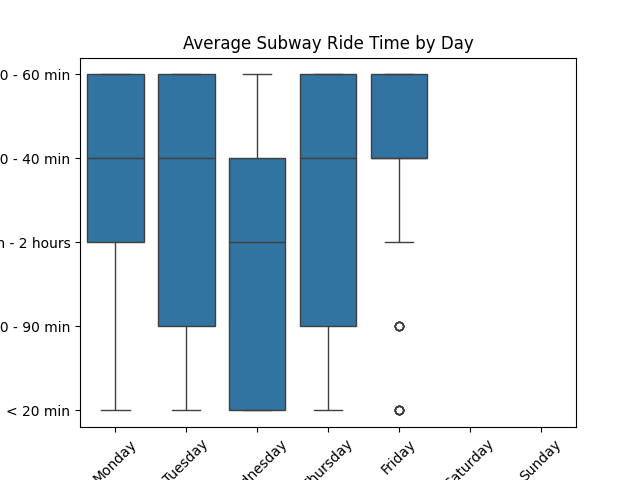
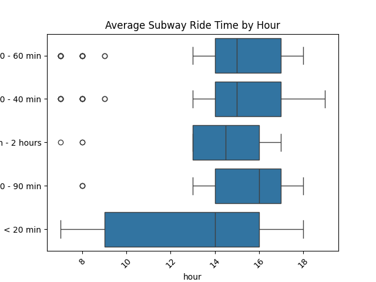
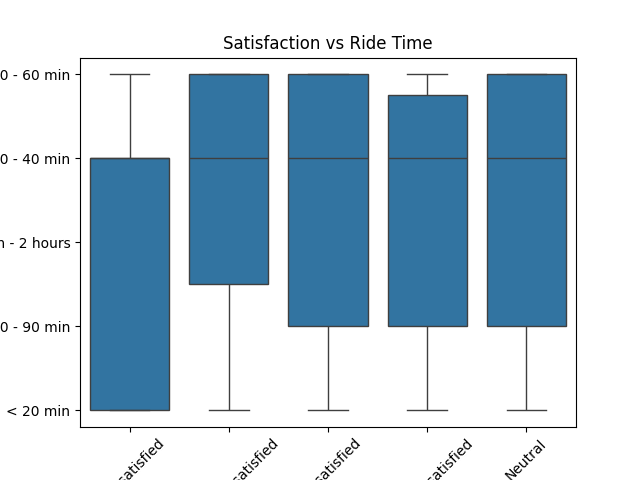
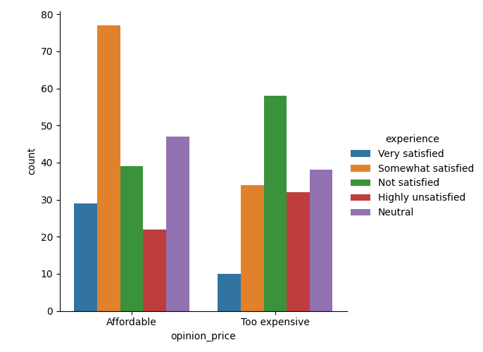

# NYC Subway Survey Analysis

Cleaned and analyzed 2019 NYC subway rider survey data using Python, Pandas, and Seaborn.

## Features
- Cleaned messy CSV data
- Parsed and extracted datetime features
- Analyzed ride time trends by day and hour
- Visualized satisfaction vs ride duration

## Example Plots

Average Subway Ride Time by Day  
Shows how ride times vary across weekdays and weekends.  

 Ride Time by Hour
Identifies peak vs off-peak travel durations.  

Satisfaction vs Ride Duration  
Do longer rides make people grumpier? Let’s find out.  

Opinions on Subway Pricing by Experience  
Breakdown of affordability opinions by satisfaction score.  

## Tools Used
- Python
- Pandas
- Seaborn
- Matplotlib

## Data Source
[NYC Open Data - Subway Survey 2019](https://data.cityofnewyork.us/City-Government/2019-Subway-Rider-Survey/4y8i-pbvd/about_data)
